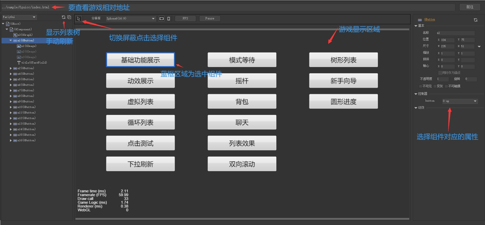

# H5GameScene

### 介绍
- H5场景组件查看工具是一款类似Unity Scene和浏览器开发者工具 select Elements功能， 查看运行中显示对象的属性，并支持实时修改

- 目前支持Laya、Egret、Cocos Creator 引擎项目的FairyGui和原生UI切换查看
后续支持原生3D对象

### 安装教程
  
- 由于工具要访问游戏的window内对象，需要在同一个域下，不然有跨域问题，所以要下载 [H5GameScene.html](http://download.zgsjl8.com/sw/minigame/lpy/H5GameScene/sample/H5GameScene.html)文件放到和要查看的项目同个域下的目录内
 
### 使用说明

- Laya项目放在和工程bin同级目录，原访问地址bin/index.html改为H5GameScene.html?url=bin%2Findex.html

- Egret项目放在和工程bin-debug同级目录，原访问地址index.html改为H5GameScene.html?url=index.html

- CoCosCreator项目放在IDE安装目录resources\static目录内，原访问地址http://localhost:7456/ 改为 http://localhost:7456/app/editor/static/H5GameScene.html?url=..%2F..%2F..%2F

显示列表暂时不支持实时刷新，需要查看的时候手动点击左上角刷新按钮

## 示例
- Laya http://download.zgsjl8.com/sw/minigame/lpy/H5GameScene/sample/H5GameScene.html?url=fguilaya
- Egret http://download.zgsjl8.com/sw/minigame/lpy/H5GameScene/sample/H5GameScene.html?url=fguiegret
- CoCosCreator http://download.zgsjl8.com/sw/minigame/lpy/H5GameScene/sample/H5GameScene.html?url=fguicc
